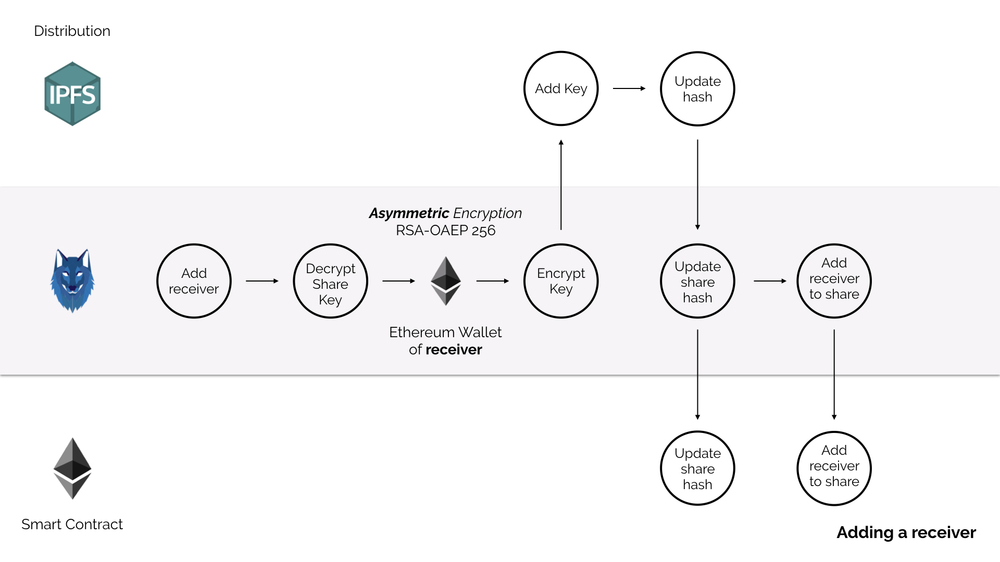

# Sharu - whitepaper

- [Sharu - whitepaper](#sharu---whitepaper)
- [Problem and motivation](#problem-and-motivation)
- [The sharu way](#the-sharu-way)
  - [Principles and the approach](#principles-and-the-approach)
  - [Sharu flows](#sharu-flows)
    - [Creating a new share](#creating-a-new-share)
    - [Adding a receiver](#adding-a-receiver)
    - [Adding a new file](#adding-a-new-file)
  - [Components](#components)
    - [IPFS](#ipfs)
    - [Smart contract](#smart-contract)
      - [Current Limitations](#current-limitations)

# Problem and motivation

Nowadays, data is exchanged almost entirely via the Internet. The respective services are trusted that (a) the data is secure and (b) is not passed on. Recent events around Cambridge Analytica or data breaches on a weekly basis impressively demonstrate that any service can either sell data directly or indirectly or can be compromised with enough criminal energy.

This inevitably leads to customers having to take care of the security of their data themselves. 

The common file sharing services guarantee that the user data is secure, but in any case the service provider can access it. If a user also wants to disguise the data from the providers, this is his own responsibility. However, they give up the convenience and have to take care of the technology.

The problem can be explained much more broadly, but let's be honest: it has already been enough.

To put it in a nutshell, the following principles must be observed:
1. Data must not be visible to unauthorized persons at any time.
2. The service and data management must not be dependent on a single service.

# The sharu way

## Principles and the approach

The principles described are solved in a familiar manner:
1. End-to-end encryption
2. Decentralisation of service and data management

## Sharu flows

### Creating a new share

1. Create a new share.
2. Sharu generates a random symmetric key for the share and some meta files to manage the share.
3. The key will be encrypted with the Ethereum Wallet of the share owner.
4. The share will be added to IPFS.
5. IPFS returns the corresponding hash of the created folder.
6. Sharu publishes the share and the hash to the ethereum contract.

### Adding a receiver

1. To add a receiver to a share the wallet address has to be known by the smart contract. Add the receiver by adding the wallet address to the share.
2. Sharu decrypts the key of share with the owners wallet address.
3. The share key will be encrypted with the wallet address of the receiver and added to the share.
4. Because the content of the share has changed IPFS generates a new hash.
5. Sharu updates the has of the share within the smart contract and adds the wallet address of the receiver to the list of receivers within the smart contract.

### Adding a new file

1. Sharu decrypts the sharu key with the wallet of the owner.
2. The file will be encrypted with the share key and added to the share.
3. IPFS generates a new hash for the share.
4. The hash will be updated within the smart contract.

## Components

### IPFS

IPFS is the inter-planetary file system. According to the creater it is a peer-to-peer hypermedia protocol to make the web faster, safer, and more open. If you have no idea what IPFS is I strongly recommend to have a look at [https://ipfs.io/](https://ipfs.io/). It's worth it!

The desktop version of Sharu comes with a built-in IPFS daemon. The daemon runs as long as the application is running and shuts down when the app is closed.

This is also the minimum setup to share files: In this scenario, User A only shares with User B if both have the application, and thus the IPFS daemon, running.

But this minimal setup is by far not enough if you want to share files seriously. For this reason, anyone can set up an IPFS node that, depending on the configuration, will make files available over IPFS even if the Sharu app is not running.

We ourselves offer a Sharu node that pins all files up to a size of 10MB, which is enough to play around with Sharu. Our work on a Sharu node has not yet been completed, a [very basic first version](https://github.com/sharu-io/pinning-node) is already there.

### Smart contract

Sharu uses an [Ethereum](https://www.ethereum.org/) smart contract on a permissioned blockchain on [Kaleido](https://kaleido.io/).

The smart contract is the decentralized share and permission management of Sharu. Three entities are managed in the smart contract: the shares, the owners and the receivers. If a new share is created, the corresponding IPFS hash is stored in the contract. In this turn, the owner is linked.

If a receiver is added, a share references the corresponding wallet address of the receiver.

#### Current Limitations

Currently only the owner himself can add or remove files to the share. A system in which several users can do this is planned but not yet implemented.
